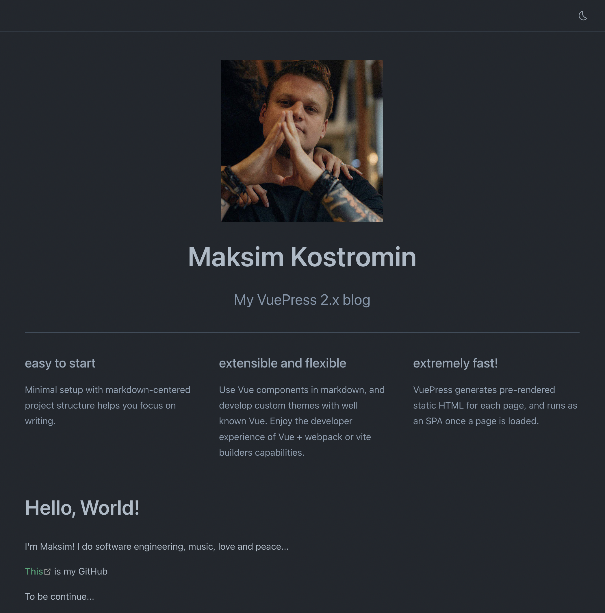

# VuePress 2.x Getting Started

In this guide we will be looking into VuePress 2.x which currently is in beta but very promising.
We will build simple customized blog with home page only. Using this skeleton can be just enough for many people who would like to quickly
get something easy to use, working, fast and very nice looking...

[[toc]]

## Install NodeJS

VuePress required NodeJS to be installed. Please check [download page](https://nodejs.org/uk/download/) to see how to install it on your
operating system.

I personally always prefer use command line:

<CodeGroup>
  <CodeGroupItem title="macOS Homebrew" active>

```bash:no-line-numbers
brew reinstall node
```

  </CodeGroupItem>

  <CodeGroupItem title="Windows scoop">

```batch:no-line-numbers
scoop install nodejs
```

  </CodeGroupItem>
</CodeGroup>

<!-- See: https://v2.vuepress.vuejs.org/reference/default-theme/components.html#codegroupitem -->

::: tip
See more options [here](https://nodejs.org/uk/download/package-manager/)
:::

## Initialize project

Create (for example: `customized-vuepress-2-blog`) project folder and initialize NodeJS project in it:

<CodeGroup>
  <CodeGroupItem title="Unix bash" active>

```bash:no-line-numbers
mkdir ~/customized-vuepress-2-blog && cd $_
npm init -y
```

  </CodeGroupItem>

  <CodeGroupItem title="Windows batch">

```batch:no-line-numbers
mkdir %USERPROFILE%\customized-vuepress-2-blog
cd %USERPROFILE%\customized-vuepress-2-blog
npm init -y
```

  </CodeGroupItem>
</CodeGroup>

## Install minimal require software

Let's install vuepress 2.x as our main blog engine, rimraf to clean files and folders, cross-env and NodeJS types (see `package.json` file):

```bash:no-line-numbers
npm i -ED vuepress@next
npm i -ED cross-env rimraf @types/npm
```

<!--

```bash
npm i -ED vuepress@next vuepress-plugin-use-pages @vuepress/plugin-register-components @vuepress/plugin-search @vuepress/theme-default
npm i -ED cross-env glob @types/npm rimraf
```

-->

## Git ignore configuration

Let's ignore IntelliJ IDEA NodeJS modules and VuePress temporal, cache and output folders and files in `.gitginore` file:

```bash:no-line-numbers
echo "/.idea/"            >> .gitignore
echo "/.vuepress/.cache/" >> .gitignore
echo "/.vuepress/.temp/"  >> .gitignore
echo "/.vuepress/dist/"   >> .gitignore
echo "/node_modules/"     >> .gitignore
```

## Add NPM scripts

Update `package.json` file with next npm-scripts: 

```json:no-line-numbers
{
  "scripts": {
    "dev": "vuepress dev .",
    "build": "vuepress build ."
  }
}
```

## Static resources

Our site should looks unique, so we will require to add our photos, pictures or favicon logos...
If you want to refer on some picture or any other resource by static path you should place that resource in `.vuepress/public` folder.
For example I have 2 files I'm referring on: `favicon.ico` and `me-2020-11.jpeg` in that folder:

```
.vuepress/public
├── favicon.ico
└── me-2020-11.jpeg
```

## Site content

Last missing peace we left to do is write our blog home page in user friendly [markdown](https://www.markdownguide.org/basic-syntax/)
format (file with `.md` extensions). This will help us focus on a writing only and VuePress will take care of everything else: styles,
positioning, fonts, highlighting, etc...

```markdown
---
home: true
heroImage: me-2020-11.jpeg
heroText: Maksim Kostromin
tagline: My VuePress 2.x blog
features:
- title: easy to start
  details: Minimal setup with markdown-centered project structure helps you focus on writing.
- title: extensible and flexible
  details: Use Vue components in markdown, and develop custom themes with well known Vue. Enjoy the developer experience of Vue + webpack
           or vite builders capabilities.
- title: extremely fast!
  details: VuePress generates pre-rendered static HTML for each page, and runs as an SPA once a page is loaded.
---

# Hello, World! [](https://github.com/daggerok/customized-vuepress-2-blog/actions/workflows/ci.yaml)

I'm Maksim! I do software engineering, music, love and peace...

[This](https://github.com/daggerok) is my GitHub

To be continue...
```

## Run and test

Start developer server:

```bash
npm run dev
```

Open [http://localhost:8080/](http://localhost:8080/) page to see results:

<CodeGroup>
  <CodeGroupItem title="light theme" active>


  </CodeGroupItem>

  <CodeGroupItem title="dark theme">



  </CodeGroupItem>
</CodeGroup>

## Custom styling

Currently, home page picture looking nice, but we would like to style it a bit. Let's change that picture from square to circle.
To do so, we should add `.vuepress/styles/index.scss` with next context:

```scss
main > header > img {
  border-radius: 50%;
}
```

Let's check our browser on [http://localhost:8080/](http://localhost:8080/):

<CodeGroup>
  <CodeGroupItem title="light theme" active>


  </CodeGroupItem>

  <CodeGroupItem title="dark theme">


  </CodeGroupItem>
</CodeGroup>

Now it looks better 😎

## TODO
* Next post: Add custom local theme with Layer and Footer registered components
* Next post: Add more blog posts, use globs to autoconfigure blog sidebar and page plugin
* Next post: Use page plugin to create custom reusable blog posts component to be used on home and blog pages

## Resources and links

* [GitHub repository](https://github.com/daggerok/customized-vuepress-2-blog)
* [VuePress 2.x site](https://v2.vuepress.vuejs.org/)
